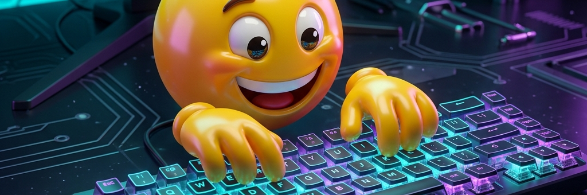

  

<h1 align="center">Hi 👋, I'm Michael Kuseh Akidiwe</h1>

  <strong>AI Automation Architect & Full-Stack Software Engineer</strong> 
  <em>Building intelligent workflows, automated systems, and high-performance web applications.</em>

  
  
  
  

---

### 🚀 About Me

I am a **Software Engineer** specializing in **Artificial Intelligence & Full-Stack Software Engineering**. I design and implement intelligent automated pipelines that connect applications, databases, and LLMs (Large Language Models) to streamline business operations, remove manual bottlenecks, and drive digital transformation.

- 🤖 **AI Automations**: Expert in **n8n** (self-hosted & cloud), Zapier, LangChain, and API-first AI integrations.
- 👨‍💻 **Full-Stack Development**: Experienced in React, Vue.js, Next.js, Node.js, and Express.
- 📦 **Databases & Cloud**: Proficient in MongoDB, MySQL, Firebase, MS SQL Server, and AWS.
- 📝 **Writing**: I regularly write technical articles sharing my automation discoveries on [Medium](https://medium.com/@michaelakidewe).

---

### 🛠️ Languages, Tools & Technologies

#### 🤖 AI, Automations & Workflows

  
  
  
  

#### 💻 Front-End & Mobile Development

  
  
  
  
  
  
  
  
  
  
  
  
  
  

#### ⚙️ Back-End, Databases & Cloud Infrastructure

  
  
  
  
  
  
  
  
  
  
  

#### 📊 Data Science & Scientific Computing

  
  
  
  
  
  
  
  

#### 🔧 Professional Dev Tools

  
  
  
  
  
  
  
  
  

---

### 📊 GitHub Activity & Stats

  
  

---

### ✍️ Latest Blog Posts
<!-- BLOG-POST-LIST:START -->
<!-- BLOG-POST-LIST:END -->

---

### 🤝 Connect with Me

  
  
  
  
  
  
  
  
  
  
  

